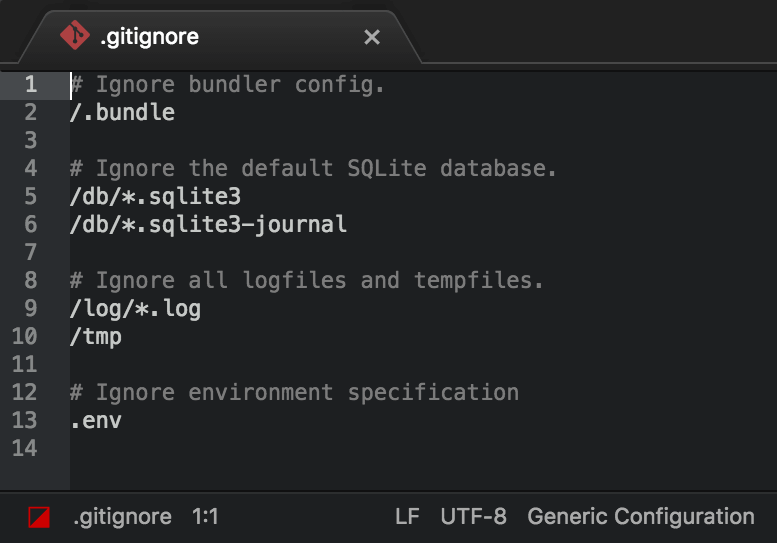
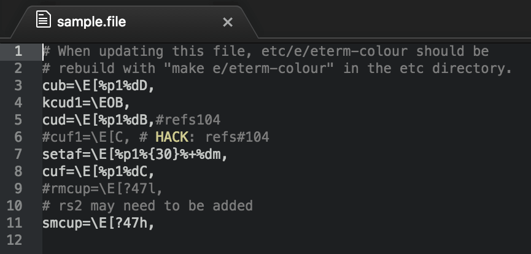

# Generic Config Language

Provides basic syntax highlighting for configuration files that are just composed of comments or non-comments with no particular structure, like `.gitignore` or `.gitattributes` files.

The package supports formats which use `#` or `;` to introduce comments.

## Auto-matching "probable" config files

Many generic configs in the wild use no standard file extension, or any extension at all.
The package is able to match unfamiliar configs as long as they contain "comment-like" lines:

~~~
# When updating this file, etc/e/eterm-colour should be
# rebuild with "make e/eterm-colour" in the etc directory.
cub=\E[%p1%dD,
kcud1=\EOB,
cud=\E[%p1%dB,#refs104
#cuf1=\E[C, # HACK: refs#104
setaf=\E[%p1%{30}%+%dm,
cuf=\E[%p1%dC,
#rmcup=\E[?47l,
# rs2 may need to be added
smcup=\E[?47h,
~~~

With the package's default configuration, the above code will look like this:

You can customise how the package interprets "comment-like" by tweaking the `automatchPattern` field in the package settings.
By default, the grammar is activated for any unknown file containing lines which start with `# ` or `; `:

~~~
# Comment
#1 - Not
#2 - considered
#3 - comments
; Comment
;1 - As above…
~~~

## Copyright

Copyright &copy; 2014-2017 by [Lee Dohm](http://www.lee-dohm.com) and [Lifted Studios](http://www.liftedstudios.com). See [LICENSE](https://github.com/lee-dohm/language-generic-config/blob/master/LICENSE.md) for details.
